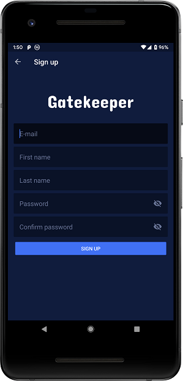

# Gatekeeper Android
Gatekeeper Android is a native Android application that let's you control gates exposed by [Gatekeeper API](https://github.com/alensnajder/gatekeeper-api). 
# Features
+ Authentication
+ Account creation
+ Browse gates
+ Control gates
+ Browse history
+ Browse users
+ User details
+ Activate/deactivate users
# Screenshots




# Specs & Libraries used
+ **MVVM** Architecture
+ **[Dagger 2](https://github.com/google/dagger)** for dependency injection
+ **[RxJava2](https://github.com/ReactiveX/RxJava)** & **[RxAndroid](https://github.com/ReactiveX/RxAndroid)** for Retrofit
+ **[OkHttp](https://square.github.io/okhttp/)** for Retrofit, authentication and intercepting
+ **[Retrofit](https://github.com/square/retrofit)** for consuming and API
# License
```
Copyright (C) 2019 Alen Snajder  
Copyright (C) 2017 The Android Open Source Project

Licensed under the Apache License, Version 2.0 (the "License");
you may not use this file except in compliance with the License.
You may obtain a copy of the License at

http://www.apache.org/licenses/LICENSE-2.0

Unless required by applicable law or agreed to in writing, software
distributed under the License is distributed on an "AS IS" BASIS,
WITHOUT WARRANTIES OR CONDITIONS OF ANY KIND, either express or implied.
See the License for the specific language governing permissions and
limitations under the License.
```
